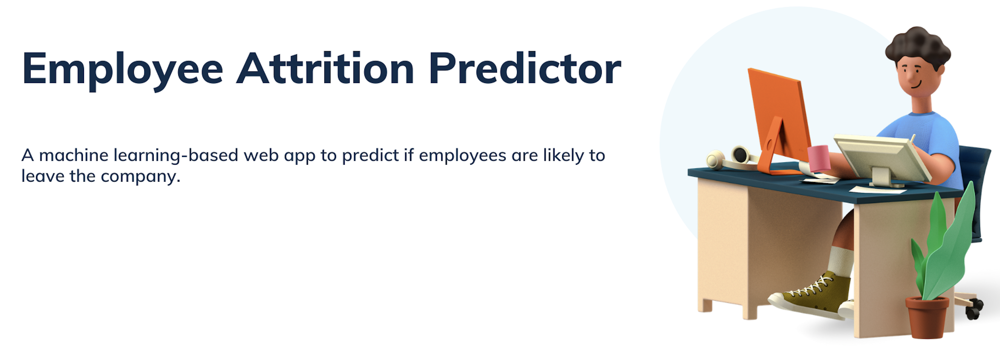

<!-- Add banner here -->

<!-- Add buttons here -->


# Demo-Preview
<!-- Add a demo for your project -->


# Table of contents
- [Installation](#installation)
- [Usage](#usage)
- [Development](#development)
- [License](#license)


# Installation
[(Back to top)](#table-of-contents)

To use this project, first clone the repo on your device by pasting the commands below:

```git init```

```git clone https://github.com/KetanThakare/employee-attrition-predictor.git```

Once you run the app.py, the website would start running on local deploymentt server. Then, enter local server address (e.g. https://) to visit the webapp. 
(You might have to install the required packages mentioned in [requriments](requirements.txt) document.)

# Usage
[(Back to top)](#table-of-contents)

The webapp is intuitive and should be easy to use. 

The steps to use the app:
1. Enter the employee's information in the text fields which are input variables for our ML model.  
2. Hit the **Predict** button to see the result. 


# Development
[(Back to top)](#table-of-contents)

CRISP-DM framework was followed.
<figure>
  
  <figcaption>Kenneth Jensens image describing the CRISP-DM steps</figcaption>
</figure>
    
\             
\

**Business and Data understanding:** The dataset used can be found [here](Notebooks/Human_Resources.csv) and was sourced from Kaggle.

**Data Preparation:** The notebook can be found [here](Notebooks/Data%20Preparation.ipynb)

**Modeling and Evaluation:** [This notebook](Noteboks/Modeling%20and%20Evaluation.ipynb) decribes model creation and evalutaion.

**Deployment:** The web-app described has been created to run on local deployment server._(Under process: to deploy the model on AWS server so it's accesible via internet.)_ 


# License
[(Back to top)](#table-of-contents)

[MIT License](https://github.com/git/git-scm.com/blob/main/MIT-LICENSE.txt)
